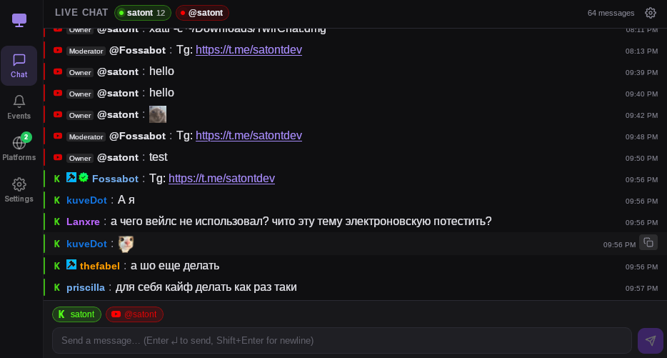

# TwirChat

Multi-platform chat manager for streamers (Twitch, YouTube, Kick).




## Installation

### Linux

```bash
curl -fsSL https://github.com/Satont/twirchat/releases/latest/download/install-linux.sh | bash
```

After installation the app is available in the applications menu and via the `twirchat` command in the terminal.
